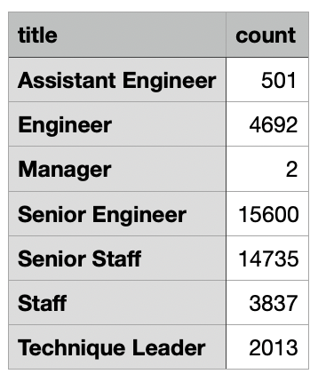
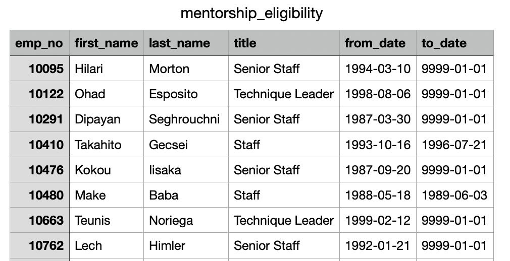
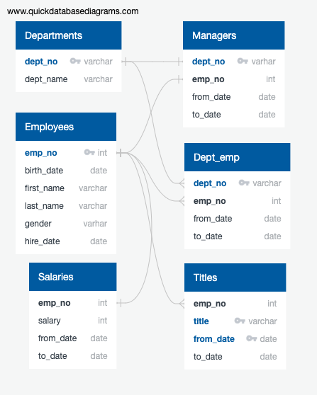

# Pewlett-Hackard-Analysis

Pewlett-Hackard is a lage company with several thousand employees. We will be using SQL to analyse their employee data to understand
1. How many employees will be retiring? and 
2. How many positions will Pewlett-Hackard need to fill?

## Project Overview

We will be looking at the data available to build an employee database with SQL by applying data modelling, data engineering and analysis skills.

Objectives:
- Create an ERD to understand relationships between data tables
- Create table to get employees eligible for retirement
- Import data tables to SQL
- Use JOIN in SQL to create new tables
- Use GROUPBY to get number of employees retiring by department name or title
- Export output tables from SQL

## Resources

- Data Source : departments.csv, dept_emp.csv, dept_manager.csv, employees.csv, titles.csv, salaries.csv
- Softwares : PostgreSQL 11, VS Code 1.44.2

## Summary

1. After filtering for birth date and hire date we have 41380 number of employees who are eligible for retirement.

2. After using GROUPBY the number of employees retiring for each title are as below:

3. After using JOIN and filtering for employees eligible for mentorship were 1940. The first few rows of the table showing details for the eligible employees are shown below:

4. The ERD showing the relationship of the data tables:

#### Recommendations:
- Formulate department-wise projections on employees required in the furture (when current employees start retiring) depending on the projects/workload handled in each department at Pewlett-Hackard. This will help us recruit number of employeess based on workload rather than based on number of retiring employees.
- Consider the budget for salary requirements to have a maximum upper limit on how many employees can be hired a year.
